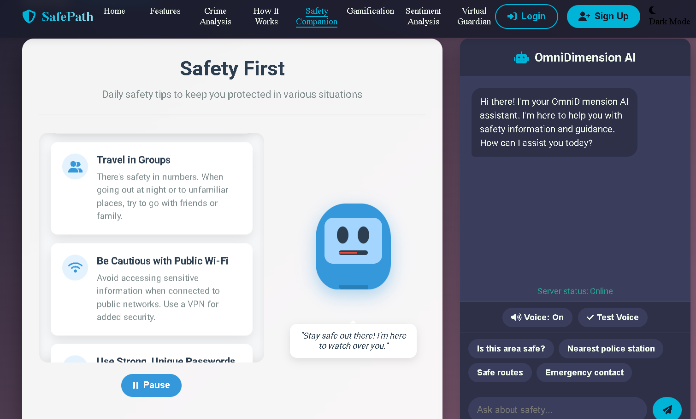
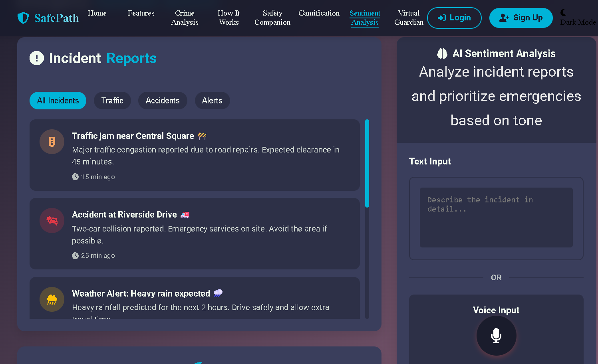
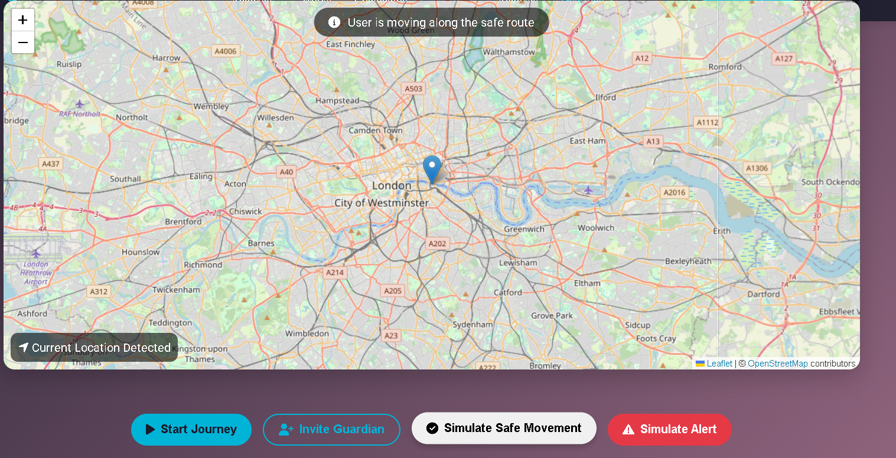
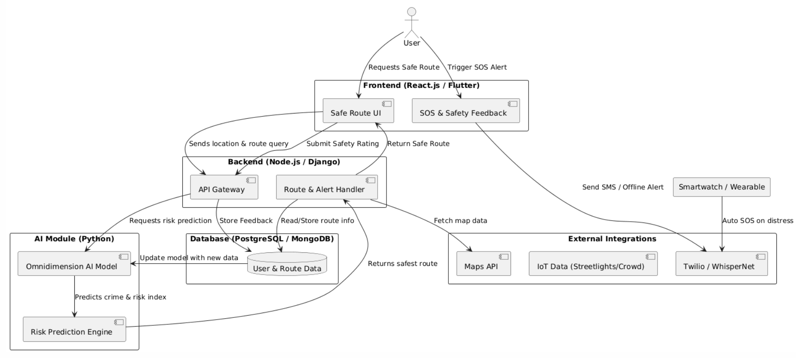

# 🛡️ SafePath — AI-Powered Smart Safety Navigation System

## 🌐 Overview

**SafePath** is an AI-powered web platform designed to enhance urban safety and navigation. It provides **real-time safe route detection**, helping users avoid unsafe areas and travel confidently—especially during late hours or in unfamiliar locations.

The system integrates **AI-driven analytics**, **crowdsourced safety data**, and **smart mapping** to suggest the most secure routes between two locations.

---

## 🎯 Problem Statement

In urban environments, **personal safety during travel**—especially for women and night-time commuters—is a growing concern. Conventional navigation apps focus on **shortest distance**, not **safest path**.

**SafePath** aims to solve this by introducing a safety-based routing system that:

- Considers **crime data**, **lighting conditions**, and **public activity levels**.  
- Suggests **alternative routes** prioritizing safety over distance.  
- Integrates with **real-time alerts** and **emergency assistance**.

---

## 💡 Key Features

- 🔍 **AI-Based Safe Route Detection** — Real-time analysis of location safety.  
- 🗺️ **Interactive Smart Map** — Displays safe, moderate, and unsafe zones.  
- 🧠 **Crowdsourced Safety Reports** — Users can flag unsafe areas or incidents.  
- 📊 **Safety Index Calculation** — Combines environmental and user data.  
- 🚨 **Emergency Mode** — Quick access to SOS and nearby help centers.  
- 📈 **Analytics Dashboard** — Visual insights on safety trends across the city.  

---

## 🖥️ Tech Stack

| Layer                  | Technology Used                                    |
| :--------------------- | :------------------------------------------------- |
| **Frontend**           | React.js, Tailwind CSS, Leaflet.js                 |
| **Backend**            | Node.js, Express.js                                |
| **Database**           | MongoDB                                            |
| **AI/ML**              | Python (Flask API), TensorFlow, OpenStreetMap APIs |
| **Cloud & Deployment** | Firebase, Netlify                                  |
| **Version Control**    | Git & GitHub                                       |

---

## 🚀 Installation & Setup

### 1️⃣ Clone the Repository
```bash
git clone https://github.com/anjali-0404/HACKX_THE-OPTIMIZERS.git
cd HACKX_THE-OPTIMIZERS
```

### 2️⃣ Install Dependencies
For both frontend and backend:
```bash
npm install
```

### 3️⃣ Configure Environment Variables
Create a `.env` file and add:
```
MONGO_URI=your_mongodb_connection
API_KEY=your_api_key
```

### 4️⃣ Run the Application
For backend:
```bash
npm run server
```
For frontend:
```bash
npm start
```
The app will start at: [http://localhost:3000](http://localhost:3000)

---

## 🎥 Demo Video

🎬 [Watch Project Demo on Google Drive](https://drive.google.com/file/d/1t42vcFXW4dq0zy9SYKcDG9Xy4x1KL51l/view?usp=drive_link)

---

## 📸 Screenshots

<table align="center">
  <tr>
    <td align="center"><b>🧠 AI Safety Companion</b></td>
    <td align="center"><b>📊 Sentiment Analysis Dashboard</b></td>
    <td align="center"><b>🗺️ Real-Time Safe Route Map</b></td>
  </tr>
  <tr>
    <td align="center"></td>
    <td align="center"></td>
    <td align="center"></td>
  </tr>
</table>


---

---

## 🧩 Project Architecture

Below is the system architecture showing how all modules interact to create a real-time, AI-powered safety network:

<p align="center">
  
</p>

---

## 🔮 Future Enhancements

- 🤖 Integration with **real-time CCTV and IoT sensors**  
- 📱 Launch of **mobile app version** (Android/iOS)  
- 🌐 **Multilingual support** for regional accessibility  
- 🧩 **Gamified safety reporting** to encourage participation  
- 🕵️ **Predictive analytics** for proactive risk detection  

---

## 👥 Team Members

| Name                | Role                                            | Contact         |
| :------------------ | :---------------------------------------------- | :-------------- |
| **Anjali Tripathi** | Team Lead · Full-Stack Developer                | 8347994864      |
| **Nency Patel**     | Backend Developer (Python)                      | 7016732835      |
| **Bhargavi Modi**   | Data Scientist                                  | 9313398898      |
| **Drashti Gajera**  | Frontend Developer (HTML & CSS)                 | 7265987063      |
| **Faculty Mentor:** | _Sunit Parmar_, MBIT, CE/IT Department, Gujarat | +91 99781 00842 |

---

## 🏆 Achievements

- Selected for **Smart India Hackathon 2025 Internal Round**  
- Implemented **AI-based route scoring algorithm**  
- Built a **fully functional prototype** with interactive map and safety metrics  

---

## 🧠 Research Insights

- Leveraged **Open Data APIs** (crime data, traffic density, street lighting)  
- Designed a **Safety Index Model** combining multiple weighted parameters  
- Integrated **real-time heatmap visualization** for better route clarity  

---

## 📚 References

- OpenStreetMap API Documentation  
- TensorFlow for Predictive Analysis  
- Firebase Cloud Hosting  
- Government Crime Data Portal  

---

## 💬 Acknowledgment

Special thanks to our mentor **Prof. Sunit Parmar** for his continuous guidance and support throughout the project.

---

## 📄 License

This project is licensed under the **MIT License** — feel free to use and modify with attribution.

---

> 🚀 _"SafePath — Because the shortest route isn’t always the safest."_
